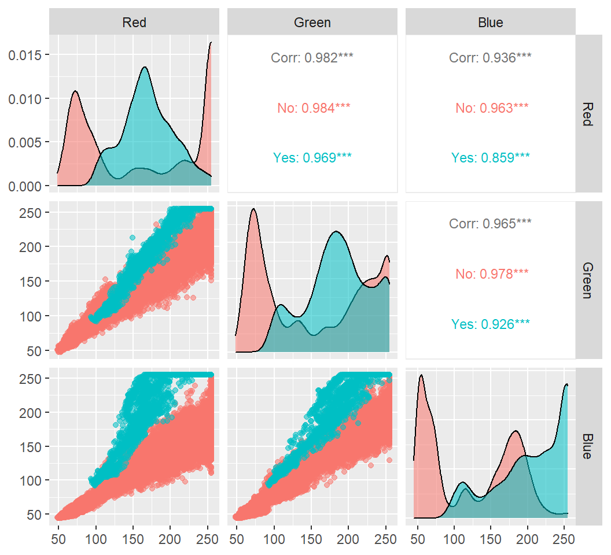
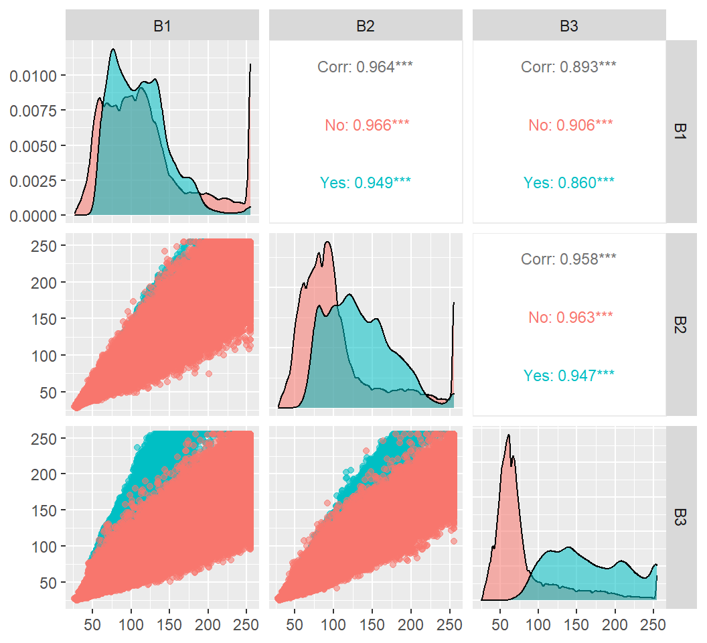

**DS 6030 \| Spring 2021 \| University of Virginia**

**By Christian Schroeder**
Full Report: https://rpubs.com/christianaaronschroeder/799196

------------------------------------------------------------------------

# Introduction

In early 2010 the Caribbean nation of Haiti was devastated by a magnitude 7.0 earthquake. This catastrophe leveled many buildings, and resulted in numerous lives lost. Most people around the world are familiar with this disaster and its level of destruction, but few are as familiar with the after-effects it had on those that lived but their homes didn't.

In the wake of the earthquake, an estimated five million people, more than 50% of the population at the time, were displaced, with 1.5 million of them living in tent camps (<https://www.worldvision.org/disaster-relief-news-stories/2010-haiti-earthquake-facts>). This wide-spread displacement of people across a country with worsened infrastructure made relief efforts more difficult. Teams needed an accurate way to locate these individuals so they could provide aid.

In an effort to assist the search, a team from the Rochester Institute of Technology (RIT) collected aerial imagery of the country. These images were then converted into datasets of Red, Green, and Blue (RGB) values. Using this RGB data from the imagery, with the knowledge that many of the displaced people were using distinguishable blue tarps as their shelter, I attempted to predict the locations of these blue tarps using several classification models.

My goal in this analysis was to determine the optimal model for locating displaced people. To determine those models, I focused on three statistics; accuracy, false positive rate (FPR), and false negative rate (FNR). Given the context of the situation, I believed the FNR to be a very important metric, much more than the false positive rate (FPR), because I wanted to make sure no displaced individual was being overlooked. I would much rather have over-classified and found no one at a certain location than under-classify and not provide aid to someone in need. But, it is important to note that these efforts still needed to be made in a timely manner, so grossly over-classifying to get the smallest FNR was not the optimal solution. So, a combination of accuracy, FNR, and FPR was used to determine these models.

# The Data

Two datasets were provided for this analysis, the training data and the hold-out data. Each dataset represented the RGB values of pixels from aerial imagery taken over Haiti after the earthquake. All seven models were trained using 10-fold cross validation and then their predictive ability tested on the hold-out dataset.

The data came in differing formats, but consisted of at least three fields defining color; Red, Green, and Blue for the training data, and B1, B2, and B3 for the hold-out data.

 

The RGB values are what were used as the predictors in the models. Additional fields were either available or created to assist analysis. The Class field defined land-classification of the pixel, whether that be vegetation, soil, rooftop, various non-tarp, or blue tarp. To make the analysis easier, a new binary field was added to the dataset representing whether or not the pixel was a "Blue Tarp." This was done to simplify the modeling process, because I was not interested in predicting the other classes. The new field, "ClassTarp," was used as the response in the models

# The Models

The following models were trained and used to predict the locations of blue tarps:
- Logistic Regression
- Linear Discriminant Analysis (LDA)
- Quadratic Discriminant Analysis (QDA)
- K-Nearest Neighbor (KNN)
- Penalized Logistic Regression (ElasticNet)
- Random Forest
- Support Vector Machines (SVM)

# ...

In-depth details of the analysis can be found in the full report: https://rpubs.com/christianaaronschroeder/799196

# ...

# Final Conclusions

### The Optimal Model (Cross-Validation)

Of the seven models trained through cross-validation, I did not see a clear winner. That is not to say the data is not suited to any particular type of model, but it is worth noting that the data was least-suited to discriminant analysis. The QDA and LDA models had the highest FPRs and lowest precisions, AUROCs, and accuracies on the table. Their high FPRs were accompanied by the highest TPRs on the table as well, which points towards both models overclassifying blue tarp pixels.

If I focused solely accuracy and FNR (1-TPR), the best models from this analysis were the QDA and KNN. The QDA model had the second to lowest accuracy, but the best performance in minimizing the FNR, which I believed was a very important value to minimize in these circumstances. All of the seven model types had AUROC, accuracy, and TPR values of at least 0.99, showing that each model would be effective.

The KNN model, with k=20 as the tuning parameter and 0.5 as the threshold, had the second highest accuracy, highest AUROC, and second highest precision metrics. It also had the second lowest FPR, which would be very beneficial to reducing wasted time on trying to reach areas no one was actually in. It is worth noting that the KNN model’s metrics might have been even higher if I had stuck with the chosen k=10 model, instead of increasing k to 20 to allow for more stability.

The random forest model had similar performance in cross-validation to the KNN model. They had matching Accuracy, identical TPR and precision, and the random forest model had the lowest FPR of all seven. In addition to an outstanding FPR, the model had the second best precision.

In a situation where people need to be located accurately and quickly, I believe it would also be pertinent to make sure no one is left behind. So when comparing these models I placed a lot of importance on the FNR (1-TPR). From that metric alone, the best model would be QDA. However, time and resources need to be considered in these situations and the FPR of the QDA model could result in a lot of wasted resources on unnecessary searches. Too keep a good balance between FNR and FPR, I believe the best model would be because of it's very low FNR and low FPR values. Though my level of confidence in this decision is not that high because these statistics are very similar, and were generated without a test data set.

### The Optimal Model (Hold-Out Test)

It was clear that the performances of most models in cross-validation and hold-out test showed major differences. Judging these performances from the same lense, finding the optimal model for locating the most displaced individuals within a reasonable amount of time and use of resources would be dependent on the FNR and FPR values. From that perspective there were two clear contenders, logistic regression and penalized logistic regression.

The logistic regression model had the second highest AUROC at 0.9994 and the lowest FPR at 0.0171. Such a low FPR would greatly improve the proper allocation of resources. Also, the logistic regression model had the highest precision seen in both the cross-validation and hold-out tests at 0.9999. These values were very impressive, but also quite similar to that of another model. The penalized logistic regression model had the highest AUROC at 0.9995, the second lowest FPR at 0.0226, and the second highest precision at 0.9998. 

Although the metrics of these models are very similar, I believed the penalized logistic regression model to be the optimal solution. This was because the increase in FPR was still quite small (especially relative to the other models), and seemed to be a sacrifice worth the increase in TPR and decrease in FNR.

### Compatible Findings

Even though the optimal models found from cross-validation and hold-out testing do not match, most results of each performance measure could be seen as compatible. it is difficult to distinguish a strong difference between values when everything either begins with 0.98 or 0.99, and the values could easily be considered identical.

Where the results are not compatible is in relative rankings. There were noticeable increases and decreases in ranks among values for several models. For TPR, QDA was the highest in cross validation, but fell to the lowest rank in the hold-out test. At the same time, random forest jumped from 6th to 3rd. Another noticeable change was in precision where SVM dropped from 3rd to last, and random forest from 1st to 6th. Although, with these drastic changes, some other models stayed relatively close to their starting rank for most metrics. It is because of this that I believe the results are reconcilable.

The discrepancies in the model performances could be attributed to the differences between the training and test data color distributions. Hue and brightness play a strong role in color values, and it could be possible the imagery had different levels of both. The training data had dimmer blues while the hold-out data had a stronger distinction between tarp and non-tarp pixels based solely on the blue value. The training on dimmer blue values could explain the increase in false positives for most models in the hold-out test, where non-tarp pixels that resembled the dimmer tarp pixels of the training data were wrongly classified. Perhaps the training data could be normalized to decrease the effects of brightness.

### Relevant Metrics

Through this analysis, I believed the most important metrics to consider for all models were FNR and FPR. Balancing both of those values would lead to an optimal solution of the most people located in the fastest time. It was very important to reduce the FNR as to make sure no displaced people were being left behind. It was also important to recognize that cost of searching for and providing aid across a devasted region. Decreasing FNR without regard for FPR would not be useful because the most people would be located, but a large amount of resources could be wasted on trying to reach areas without people present. A third important metric considered was precision. Precision provided a measure of the dispersion of prediction errors. Higher precision values imply greater confidence in the TPR and FPR values seen.  

### Real-World Application

I think this method can be effective for classifying blue tarp pixels in imagery, but I do not believe it to be the optimal solution in a real-world application. In real-world context, there are a lot of additional factors that would need to be considered before any lives could be saved. Factors like road access and closures, location of displaced people relative to airports, and available funds/resources have a huge impact on the execution and effectiveness of relief efforts. For example, more points of access to aid would need to be set up in an area with many road closures than an area of the same size and density of people with open access to roads.

I think these models can greatly benefit relief efforts and influence logistic decisions by identifying highly probable locations of displaced people, but I also recognize there is a lot more work to be done before those people can be helped.

In a country like Haiti where about 60% of the population has cell phones (https://www.statista.com/statistics/502111/mobile-cellular-subscriptions-per-100-inhabitants-in-haiti/), pinging the locations of those devices might be a faster and more accurate approach to locating displaced people.

### Model Improvement

On a larger scale of imagery, I believe the accuracy of the models could be improved with some geospatial influence. Predicting the location of people strictly off color leaves a lot of room to be misled. For example, a shed on a farm has a blue roof, or there is a water feature reflecting enough light.

If the nature of the placement of blue tarps followed a general rule, where most displaced people congregated together, then additional tools like kernel density could be used to add extra confidence to the predictions. Adding this spatial context would allow the model to rule out the "blue tarp" pixels that were located in very sparsely populated areas that are very unlikely to be hosting displaced individuals. The results of which could be provided in the form of heatmaps instead of direct point locations, which would be more beneficial to search parties by not having a strict location rather a general area in which displaced people are possibly moving locations. It is also likely that the displaced people did not travel very far from their original locations, so other factors like population density or buildings damaged in the area could also influence the predictions.

